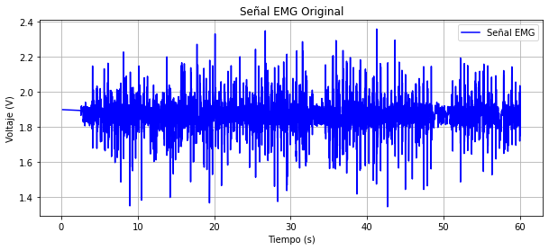
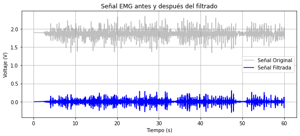
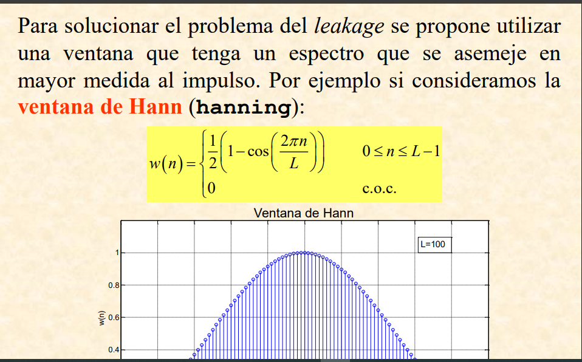
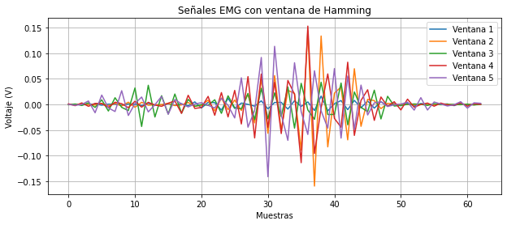
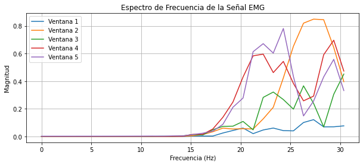

# LABORATORIO #3 PDS

## CODIGO MATLAB

## CODIGO PYTHON

### Librerias

En primer lugar vamos a importar unas librerias en donde tendremos a pandas el cual se llamara como nd ahora esta nos ayudara para graficar el csv que se explicara mas adelante, luego se observara un numpy esto para operaciones matematicas, luego veremos el matplotlib el cual nos dejara graficar y por ultimo una libreria de filtros esto cumpliendo un teorema de Niquiest. 

      import pandas as pd
      import numpy as np
      import matplotlib.pyplot as plt
      from scipy.signal import butter, filtfilt

### Cargar y graficar la señal de EMG

En primer lugar vamos a cargar la señal capturada esto en un archivo csv luego de ello va a leer el directorio de este archivo en este caso tenemos mas de una señal de EMG capturada seleccionando la "emg_signal.csv" debido a que esta fue la mejor capturada y la mejor capturada.

      # Cargar la señal EMG desde un archivo CSV
      file_path = "data/emg_signal.csv"  # Asegúrate de que el archivo esté en el mismo directorio
      df = pd.read_csv(file_path)

Luego de ello se leera el archivo csv, con el fin de extraer los datos en donde ectraeremos un eje en X y un eje en Y, siendo X el tiempo y Y el voltaje, ya con ello se estima la frecuencia de muestreo capturada esta siendo 1/ la cantidad de ciclos de periodo recordando la formula F=1/T ya con ello tomara un valor promedio de frecuencias y con ello se obtendra la frecuencia de EMG

      # Extraer datos
      tiempo = df.iloc[:, 0]  # Primera columna (Tiempo)
      voltaje = df.iloc[:, 1]  # Segunda columna (Voltaje)

      # Estimar la frecuencia de muestreo (fs)
      fs_estimates = 1 / tiempo.diff().dropna().unique()
      fs_mean = fs_estimates.mean()  # Tomar un valor promedio si hay variaciones

Ahora vamos a graficarv la señal esto con el matliplot lo que nos dira que la figura de 10 de ancho y 4 de largo y se graficara el voltaje y el tiempo esto en Y y en X ya con ello el color siendo el b diciendo blue, y con ello el titulo de la señal, los valores de los Ejes en X sera Tiempo y en Y el voltaje, esto lo pintara y se observara la grafica capturada de EMG.

      # Graficar la señal original
      plt.figure(figsize=(10, 4))
      plt.plot(tiempo, voltaje, label="Señal EMG", color="b")
      plt.xlabel("Tiempo (s)")
      plt.ylabel("Voltaje (V)")
      plt.title("Señal EMG Original")
      plt.legend()
      plt.grid(True)
      plt.show()

Donde dicha grafica observa la señal de EMG capturada en Matlab.

### Filtros y Frecuencia

Ahora se va a imprimir la frecuencia de muestreo la cual es de:

      print(f"Frecuencia de muestreo estimada: {fs_mean:.2f} Hz")

 Frecuencia de muestreo estimada: 63.73 Hz

 Esto debido a que el modulo de ECG no es exacto para EMG donde el modulo de EMG si captura frecuencias mucho mas altas de 0 Hz a 200 Hz, en cambio el de ECG captura de 0 Hz hasta 65Hz como se puede observar la frecuencia de muestreo se estima a la frecuencia de ECG

 Ahora en cuanto a los filtros usamos un tiltro de tipo Butterworth utilizamos un filtro de orden 4 con el teorema de Nyquist recordando que el filtro debe ser un minimo de la mitad de la frecuencia de corte ahora nosotros lo hicimos con un filtro de 30Hz pasa bajos y un pasa altos de 10 Hz dejando pasar una frecuencia minima de los musculos. 

      # Función para diseñar y aplicar un filtro Butterworth
      def butterworth_filter(data, cutoff, fs, filter_type, order=4):
      nyquist = 0.5 * fs  # Frecuencia de Nyquist
      normal_cutoff = cutoff / nyquist
      b, a = butter(order, normal_cutoff, btype=filter_type, analog=False)
      return filtfilt(b, a, data)

      # Aplicar filtro pasa altas (10 Hz)
      filtered_high = butterworth_filter(voltaje, 10, fs_mean, 'high')

      # Aplicar filtro pasa bajas (30 Hz)
      filtered_signal = butterworth_filter(filtered_high, 31, fs_mean, 'low')

Ahora se observara la señal de EMG captada con los filtros esto como se puede observar en la siguiente imagen:

Ahora con ello se puede observar una grafica original vs la grafica filtrada lo que nos muestra que se atenua la frecuencia debido a que se filtro cierta frecuencia, y dicho grafico sera muy similar a el grafico anteriore.

      # Graficar señal original vs filtrada
      plt.figure(figsize=(10, 4))
      plt.plot(tiempo, voltaje, label="Señal Original", alpha=0.5, color="gray")
      plt.plot(tiempo, filtered_signal, label="Señal Filtrada", color="blue")
      plt.xlabel("Tiempo (s)")
      plt.ylabel("Voltaje (V)")
      plt.title("Señal EMG antes y después del filtrado")
      plt.legend()
      plt.grid(True)
      plt.show()

### Ventana segundo a segundo

Ahora vamos a separar la señal de EMG a ventanas segundo a segundo y con ello podremos observra la fatiga muscular y el musculo sin fatigar lo que nos hara llegar a comprender que si la persona tiene algun tipo de miopatia se asimilara a una fatiga de lo contrario sino sera como una neuropatia para ello el uso de las ventanas

En primer lugar se va a definir el tamaño de las ventanas en segundos esto donde seran de 1 segundo y la ventana se dara mediante el muestreo y su frecuencia.

      # Definir tamaño de ventana en segundos
      window_size = 1  # 1 segundo por ventana
      samples_per_window = int(window_size * fs_mean)  # Convertir a muestras

Ahora se aplicara el aventamiento en donde se pondar la cantidad de datos tomados con repecto a las ventanas esto con cierto tiempo t donde se dara en un rango de el numero de ventanas 5

      # Aplicar aventanamiento
      num_windows = len(filtered_signal) // samples_per_window
      windows = [filtered_signal[i * samples_per_window:(i + 1) * samples_per_window] for i in range(num_windows)]

Ahora aplicaremos hamming esto para poder mediante el uso de un coseno ponderado, esto se da para suavizar la función de autocovarianza truncada en el dominio temporal. 

Ahora bien se dara como se puede ver en la siguiente imagen en un timepo finito.

Esto nos ayudara a obtener un tioo de campana de Gauss aplicando el Hamming como una senoidal

      # Aplicar ventana de Hamming
      windowed_signals = [w * np.hamming(len(w)) for w in windows]

Ahora se van a graficar las ventanas sin aun aplicar la transformada de Fourier esto aun no suavizara hasta llegar a cierta onda cosenoidal o campana de Gauss

      # Graficar algunas ventanas
      plt.figure(figsize=(10, 4))
      for i in range(min(5, len(windowed_signals))):
      plt.plot(windowed_signals[i], label=f'Ventana {i+1}')
      plt.xlabel("Muestras")
      plt.ylabel("Voltaje (V)")
      plt.title("Señales EMG con ventana de Hamming")
      plt.legend()
      plt.grid(True)
      plt.show()

Ahora como se veran en las ventanas de tiempo:

Aun se ha aplicado la transformada de fourier para el espectro de frecuencia y completar el Hamming ya con ello se hara dicha transformada y podra completarse el Hamming como se vera mas adelante.

      # Aplicar Transformada de Fourier (FFT) a cada ventana
      fft_results = [np.fft.fft(w) for w in windowed_signals]
      frequencies = np.fft.fftfreq(samples_per_window, d=1/fs_mean)

Aplicamos la transformada de Fourier y ahora si con ello se hara un espectro de frecuencia completando el Hamming y mostrando las ventanas como un tipo de campana de Gauss

      # Tomar solo la mitad del espectro (parte positiva)
      half_spectrum = samples_per_window // 2
      frequencies = frequencies[:half_spectrum]
      fft_magnitudes = [np.abs(fft[:half_spectrum]) for fft in fft_results]

Por ultimo se van a graficar

      # Graficar el espectro de frecuencia de algunas ventanas
      plt.figure(figsize=(10, 4))
      for i in range(min(5, len(fft_magnitudes))):
      plt.plot(frequencies, fft_magnitudes[i], label=f'Ventana {i+1}')
      plt.xlabel("Frecuencia (Hz)")
      plt.ylabel("Magnitud")
      plt.title("Espectro de Frecuencia de la Señal EMG")
      plt.legend()
      plt.grid(True)
      plt.show()

Como se vera tiende a ser cierta manera un tipo de campana de gauss con ello podremos observar y comparar el musculo fatigado y no en fatiga.