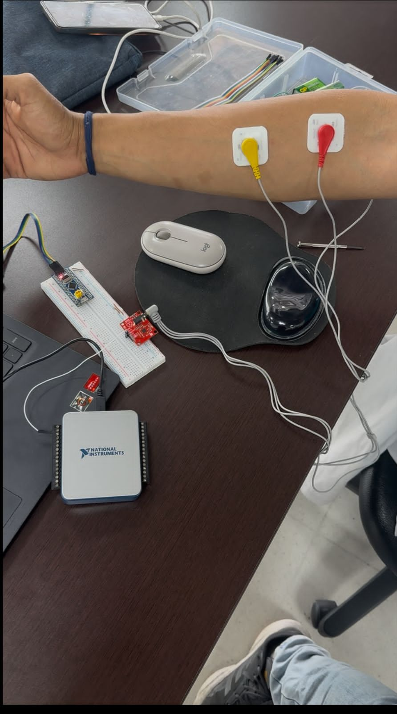

# LABORATORIO #4 PDS
### Señales electromiograficas EMG

Este informe tiene como objetivo aplicar el filtrado de señales continuas para procesar una señal electromigráfica
y detectar la fatiga muscular a través del análisis espectral de la misma.

Para entender el codigo necesitamos tener en cuenta unos conceptos importantes. 
### Contracción muscular
La contracción muscular se inicia cuando un potencial de acción, generado en la motoneurona alfa, viaja por el axón hasta la placa motora, liberando acetilcolina en la hendidura sináptica. La acetilcolina se une a receptores nicotínicos en la membrana de la fibra muscular, despolarizándola y propagando un nuevo potencial de acción a lo largo del sarcomera y los túbulos T. Esto activa los receptores de rianodina en el retículo sarcoplásmico, liberando iones de calcio (Ca⁺) al sarcoplasma. El Ca⁺ se une a la troponina en los filamentos de actina, desplazando la tropomiosina y exponiendo sitios de unión para las cabezas de miosina. Mediante el ciclo de los puentes cruzados (hidrólisis de ATP), las cabezas de miosina "caminan" sobre la actina, acortando el sarcómero y generando fuerza contráctil. La *señal EMG* capta la suma de estos potenciales eléctricos extracelulares desde múltiples unidades motoras, cuya amplitud y frecuencia dependen de la tasa de disparo de las motoneuronas.  

### Que es la electromiografia (EMG)
La electromiografía (EMG) es una técnica utilizada para evaluar y registrar la actividad eléctrica producida por los músculos esqueléticos.La EMG implica la detección de señales eléctricas generadas por las fibras musculares durante la contracción. Estas señales se transmiten a través del sistema nervioso y pueden ser medidas utilizando electrodos de superficie colocados sobre la piel o electrodos intramusculares insertados en el músculo. Esta información es importante  para diagnosticar trastornos neuromusculares, evaluar la fatiga muscular y guiar estrategias de rehabilitación.

### Toma de datos para una señal EMG
 En la adquisición de señales de electromiografía (EMG)requiere un sistema de adquisición con electrodos superficiales o intramusculares en nuestro caso se usaron electrodos de superficie, segun los buscado en articulos y paginas que hablan sobre recolección de datos dice que deberia ser  configurando a una frecuencia de muestreo ≥1000 Hz para captar la actividad muscular que es tipica  entre los (20-500 Hz). Ademas de esto nos afirman que es importante  aplicar filtros notch (50/60 Hz) para eliminar ruido de línea y filtros pasa-bandas para aislar la señal biológica. La señal original se rectifica y normaliza para su análisis en dominios de *tiempo* (amplitud, RMS) y *frecuencia* (FFT, espectro de potencia).  

Para implementación de la toma de datos EMG en Python o MATLAB, se recomienda usar librerías como *SciPy*.

### Que es un sistema de adquisición de datos DAQ

El *DAQ NI USB-6001/6002/6003* de National Instruments es un dispositivo de adquisición de datos (DAQ) compacto y de bajo costo, diseñado para aplicaciones de medición y control básicas, incluyendo la captura de señales biomédicas como *electromiografía (EMG). Estos dispositivos tienen entradas analógicas diferenciales (8/16 bits, ±10V, frecuencias de muestreo de hasta 10–48 kS/s dependiendo del modelo) con filtros anti-aliasing integrados para registrar señales EMG en el rango de 20–500 Hz. Tienen una conexión vía *USB* que permite una integración sencilla con software como LabVIEW, MATLAB o Python (usando librerías como nidaqmx), donde se pueden configurar parámetros de muestreo, aplicar filtros digitales como lo son, notch 50/60 Hz, pasa-bandas y extraer características en tiempo real. Además, incluyen entradas y salidas digitales . Aunque no es un equipo médico certificado, su relación costo-eficiencia lo hace popular en prototipos de investigación y proyectos de biomecánica, donde se requiere capturar la actividad muscular para procesamiento posterior.

### Implementación de filtros para una señal
Las señales EMG a menudo están contaminadas con ruido y artefactos, lo que nos hace  aplicar diversas técnicas de procesamiento de señales para un análisis preciso como los son los filtros.

El *filtro pasa altas* (típicamente con frecuencia de corte entre 10-20 Hz) elimina componentes de baja frecuencia como los artefactos de movimiento, deriva de la línea base y potenciales lentos asociados al desplazamiento de los electrodos, que pueden enmascarar la verdadera actividad muscular. Por otro lado, el *filtro pasa bajas* (con corte entre 400-500 Hz) atenúa el ruido de alta frecuencia generado por interferencias electromagnéticas, ruido térmico de los componentes electrónicos y artefactos de conmutación, preservando las componentes espectrales relevantes de la señal EMG que generalmente se concentran entre 20-400 Hz. Esta combinación de filtrado (que técnicamente forma un filtro pasa banda cuando se aplican secuencialmente) mejora significativamente la relación señal-ruido, permitiendo una mejor caracterización de parámetros como la amplitud RMS, la densidad espectral de potencia o los patrones de activación muscular.
 *Imagen 1. FIR filter software.*
### Aventanamiento
l *aventanamiento* (o windowing) es una técnica usada en PDS para reducir las discontinuidades en los bordes de un segmento finito de señal al aplicar la *Transformada de Fourier Discreta (DFT). Como las señales reales son de duración limitada, truncarlas abruptamente introduce *fugas espectrales (artefactos de alta frecuencia). Las *ventanas* suavizan los bordes de la señal, atenuando estos efectos.  

#### *Ventanas de Hamming y Hann(ing)*  
- *Ventana de Hamming:* Definida como 
   
      w(n) = 0.54 - 0.46 cos(2pi n)/N-1

ES ideal para aplicaciones donde se prioriza la atenuación de fugas espectrales (ej: análisis de frecuencias cercanas).  

- *Ventana de Hann(ing):* Dada por 

      w(n) = 0.5(1-cos(2pi n/N-1))
  
 Se utiliza 
  cuando se necesita mejor resolución en frecuencia (ej: identificación de tonos musicales). Ambas ventanas son *no paramétricas* y se usan en análisis espectral (FFT).
  

 ## Procedimiento de la practica
  - Inicialmente se colocaron electrodos al brazo de una persona y se le pidió que realizara unas contracciones hasta llegar a la fatiga muscular.

- Posteriormente se capturó la señal en tiempo real en medio de mathlab, por medio del sistema DAQ.

## CODIGO MATLAB
Ahora en cuanto al codigo requerimos uno de adquisicion dicho codigo permitira adquirir los datos de EMG a traves de un DAQ y un sensor de ECG ahora dicho esto debemos tener en cuenta el Dev o el puerto de conexion siendo Dev2, el canal que sera ai0 este transmite datos, tener une frecuencia de muestreo de 1000 Hz y una duracion de 60 segundos ademas de guardar toda la señal capturada de EMG en un cvs

      % ======= CONFIGURACIÓN =======
      device = 'Dev2';     % Nombre de tu DAQ (ajusta si es diferente)
      channel = 'ai0';     % Canal de entrada (por ejemplo, ai0)
      sampleRate = 1000;   % Frecuencia de muestreo (Hz)
      duration = 60;       % Duración total (segundos)
      outputFile = 'emg_signal.csv';  % Nombre del archivo a guardar

En primer lugar va a crear un sesion esto hacia el DAQ leyendo y corroborando dichos datos del mismo.

      % ======= CREAR SESIÓN =======
      d = daq("ni");  % Crear sesión para DAQ NI
      addinput(d, device, channel, "Voltage");  % Agregar canal de entrada
      d.Rate = sampleRate;

Ahora tendremos dos valores uno el cual sera el tiempo en el eje x siendo de 60 segundos y la señal que sera en volteos esta señal sera el cambio de potencial de los musculos.

      % ======= VARIABLES =======
      timeVec = [];  % Vector de tiempo
      signalVec = [];  % Vector de señal

Ahora tendremos una interfaz grafica simple en donde se va a graficar el tiempo en X y en Y se grafica el voltaje, ya con ello se podra caprurar la EMG en tiempo real, en x tendremos la ventada de 0 a la duracion 60 segundos y en y sera de 0 a 4 volteos siendo 3.3 el maximo voltaje arrojado como se muestra en la imagen.

      % ======= CONFIGURAR GRÁFICA =======
      figure('Name', 'Señal en Tiempo Real', 'NumberTitle', 'off');
      h = plot(NaN, NaN);
      xlabel('Tiempo (s)');
      ylabel('Voltaje (V)');
      title('Señal EMG en Tiempo Real');
      xlim([0, duration]);
      ylim([0, 4]);  % Ajusta el rango de voltaje si es necesario
      grid on;

Ahora con ello se van a guardar los datos y se van a adquirir y con ello se guardar como un archivo csv para procesarce en matlab

      % ======= ADQUISICIÓN Y GUARDADO =======
      disp('Iniciando adquisición...');
      startTime = datetime('now');

Ahora va a graficar punto pot punto y con ello se mantendra en un tipo de matriz y arreglo y con ello graficara punto por punto con un drawline

      while seconds(datetime('now') - startTime) < duration
      % Leer una muestra
      [data, timestamp] = read(d, "OutputFormat", "Matrix");
      
      % Guardar datos en vectores
      t = seconds(datetime('now') - startTime);
      timeVec = [timeVec; t];
      signalVec = [signalVec; data];
      
      % Actualizar gráfica
      set(h, 'XData', timeVec, 'YData', signalVec);
      drawnow;
      end

Por ultimo guardara dichos datos del arreglo en un archivo csv.

      % ======= GUARDAR LOS DATOS =======
      disp('Adquisición finalizada. Guardando archivo...');
      T = table(timeVec, signalVec, 'VariableNames', {'Tiempo (s)', 'Voltaje (V)'});
      writetable(T, outputFile);
      disp(['Datos guardados en: ', outputFile]);

      % ======= CERRAR SESIÓN =======
      clear d;

Donde dicha señal tuvo un circuito de adquisicion el cual se observara en la siguiente imagen:

## CODIGO PYTHON

### Librerias

En primer lugar vamos a importar unas librerias en donde tendremos a pandas el cual se llamara como nd ahora esta nos ayudara para graficar el csv que se explicara mas adelante, luego se observara un numpy esto para operaciones matematicas, luego veremos el matplotlib el cual nos dejara graficar y por ultimo una libreria de filtros esto cumpliendo un teorema de Niquiest. 

      import pandas as pd
      import numpy as np
      import matplotlib.pyplot as plt
      from scipy.signal import butter, filtfilt

### Cargar y graficar la señal de EMG

En primer lugar vamos a cargar la señal capturada esto en un archivo csv luego de ello va a leer el directorio de este archivo en este caso tenemos mas de una señal de EMG capturada seleccionando la "emg_signal.csv" debido a que esta fue la mejor capturada y la mejor capturada.

      # Cargar la señal EMG desde un archivo CSV
      file_path = "data/emg_signal.csv"  # Asegúrate de que el archivo esté en el mismo directorio
      df = pd.read_csv(file_path)

Luego de ello se leera el archivo csv, con el fin de extraer los datos en donde ectraeremos un eje en X y un eje en Y, siendo X el tiempo y Y el voltaje, ya con ello se estima la frecuencia de muestreo capturada esta siendo 1/ la cantidad de ciclos de periodo recordando la formula F=1/T ya con ello tomara un valor promedio de frecuencias y con ello se obtendra la frecuencia de EMG

      # Extraer datos
      tiempo = df.iloc[:, 0]  # Primera columna (Tiempo)
      voltaje = df.iloc[:, 1]  # Segunda columna (Voltaje)

      # Estimar la frecuencia de muestreo (fs)
      fs_estimates = 1 / tiempo.diff().dropna().unique()
      fs_mean = fs_estimates.mean()  # Tomar un valor promedio si hay variaciones

Ahora vamos a graficarv la señal esto con el matliplot lo que nos dira que la figura de 10 de ancho y 4 de largo y se graficara el voltaje y el tiempo esto en Y y en X ya con ello el color siendo el b diciendo blue, y con ello el titulo de la señal, los valores de los Ejes en X sera Tiempo y en Y el voltaje, esto lo pintara y se observara la grafica capturada de EMG.

      # Graficar la señal original
      plt.figure(figsize=(10, 4))
      plt.plot(tiempo, voltaje, label="Señal EMG", color="b")
      plt.xlabel("Tiempo (s)")
      plt.ylabel("Voltaje (V)")
      plt.title("Señal EMG Original")
      plt.legend()
      plt.grid(True)
      plt.show()

Donde dicha grafica observa la señal de EMG capturada en Matlab.
El eje *y* de una señal EMG representa la amplitud del voltaje registrado por los electrodos, generalmente medido en milivoltios (mV) o microvoltios (µV). Esta amplitud refleja la actividad eléctrica generada por las fibras musculares durante su contracción.

### Filtros y Frecuencia

Ahora se va a imprimir la frecuencia de muestreo la cual es de:

    print(f"Frecuencia de muestreo estimada: {fs_mean:.2f} Hz")

 Frecuencia de muestreo estimada: 63.73 Hz.

 Esto debido a que el modulo de ECG no es exacto para EMG donde el modulo de EMG si captura frecuencias mucho mas altas de 0 Hz a 200 Hz, en cambio el de ECG captura de 0 Hz hasta 65Hz como se puede observar la frecuencia de muestreo se estima a la frecuencia de ECG

 Ahora en cuanto a los filtros usamos un tiltro de tipo Butterworth utilizamos un filtro de orden 4 con el teorema de Nyquist recordando que el filtro debe ser un minimo de la mitad de la frecuencia de corte ahora nosotros lo hicimos con un filtro de 30Hz pasa bajos y un pasa altos de 10 Hz dejando pasar una frecuencia minima de los musculos. 

      # Función para diseñar y aplicar un filtro Butterworth
      def butterworth_filter(data, cutoff, fs, filter_type, order=4):
      nyquist = 0.5 * fs  # Frecuencia de Nyquist
      normal_cutoff = cutoff / nyquist
      b, a = butter(order, normal_cutoff, btype=filter_type, analog=False)
      return filtfilt(b, a, data)

      # Aplicar filtro pasa altas (10 Hz)
      filtered_high = butterworth_filter(voltaje, 10, fs_mean, 'high')

      # Aplicar filtro pasa bajas (30 Hz)
      filtered_signal = butterworth_filter(filtered_high, 31, fs_mean, 'low')

Ahora se observara la señal de EMG captada con los filtros esto como se puede observar en la siguiente imagen:

Ahora con ello se puede observar una grafica original vs la grafica filtrada lo que nos muestra que se atenua la frecuencia debido a que se filtro cierta frecuencia, y dicho grafico sera muy similar a el grafico anteriore.

      # Graficar señal original vs filtrada
      plt.figure(figsize=(10, 4))
      plt.plot(tiempo, voltaje, label="Señal Original", alpha=0.5, color="gray")
      plt.plot(tiempo, filtered_signal, label="Señal Filtrada", color="blue")
      plt.xlabel("Tiempo (s)")
      plt.ylabel("Voltaje (V)")
      plt.title("Señal EMG antes y después del filtrado")
      plt.legend()
      plt.grid(True)
      plt.show()

### Ventana segundo a segundo

Ahora vamos a separar la señal de EMG a ventanas segundo a segundo y con ello podremos observra la fatiga muscular y el musculo sin fatigar lo que nos hara llegar a comprender que si la persona tiene algun tipo de miopatia se asimilara a una fatiga de lo contrario sino sera como una neuropatia para ello el uso de las ventanas

En primer lugar se va a definir el tamaño de las ventanas en segundos esto donde seran de 1 segundo y la ventana se dara mediante el muestreo y su frecuencia.

      # Definir tamaño de ventana en segundos
      window_size = 1  # 1 segundo por ventana
      samples_per_window = int(window_size * fs_mean)  # Convertir a muestras

Ahora se aplicara el aventamiento en donde se pondar la cantidad de datos tomados con repecto a las ventanas esto con cierto tiempo t donde se dara en un rango de el numero de ventanas 5

      # Aplicar aventanamiento
      num_windows = len(filtered_signal) // samples_per_window
      windows = [filtered_signal[i * samples_per_window:(i + 1) * samples_per_window] for i in range(num_windows)]

Ahora aplicaremos hamming esto para poder mediante el uso de un coseno ponderado, esto se da para suavizar la función de autocovarianza truncada en el dominio temporal. 

Ahora bien se dara como se puede ver en la siguiente imagen en un timepo finito.

Esto nos ayudara a obtener un tioo de campana de Gauss aplicando el Hamming como una senoidal

      # Aplicar ventana de Hamming
      windowed_signals = [w * np.hamming(len(w)) for w in windows]

Ahora se van a graficar las ventanas sin aun aplicar la transformada de Fourier esto aun no suavizara hasta llegar a cierta onda cosenoidal o campana de Gauss

      # Graficar algunas ventanas
      plt.figure(figsize=(10, 4))
      for i in range(min(5, len(windowed_signals))):
      plt.plot(windowed_signals[i], label=f'Ventana {i+1}')
      plt.xlabel("Muestras")
      plt.ylabel("Voltaje (V)")
      plt.title("Señales EMG con ventana de Hamming")
      plt.legend()
      plt.grid(True)
      plt.show()

Ahora como se veran en las ventanas de tiempo:

Aun se ha aplicado la transformada de fourier para el espectro de frecuencia y completar el Hamming ya con ello se hara dicha transformada y podra completarse el Hamming como se vera mas adelante.

      # Aplicar Transformada de Fourier (FFT) a cada ventana
      fft_results = [np.fft.fft(w) for w in windowed_signals]
      frequencies = np.fft.fftfreq(samples_per_window, d=1/fs_mean)

Aplicamos la transformada de Fourier y ahora si con ello se hara un espectro de frecuencia completando el Hamming y mostrando las ventanas como un tipo de campana de Gauss

      # Tomar solo la mitad del espectro (parte positiva)
      half_spectrum = samples_per_window // 2
      frequencies = frequencies[:half_spectrum]
      fft_magnitudes = [np.abs(fft[:half_spectrum]) for fft in fft_results]

Por ultimo se van a graficar

      # Graficar el espectro de frecuencia de algunas ventanas
      plt.figure(figsize=(10, 4))
      for i in range(min(5, len(fft_magnitudes))):
      plt.plot(frequencies, fft_magnitudes[i], label=f'Ventana {i+1}')
      plt.xlabel("Frecuencia (Hz)")
      plt.ylabel("Magnitud")
      plt.title("Espectro de Frecuencia de la Señal EMG")
      plt.legend()
      plt.grid(True)
      plt.show()

Como se vera tiende a ser cierta manera un tipo de campana de gauss con ello podremos observar y comparar el musculo fatigado y no en fatiga.

### Estadisticos de Ventanas

Ahora bien tenemos en cuenta las ventana anteriormente calculadas solo con la transfmordad de fourier tendian a parecerse a la onda cosenoidal de Hamming ahora con ello se tomaran dichas ventanas y se hara una prueba estadistica entre ambos casos.

En primer lugar se definio una funcion con el fin de obtener los datos estadisticos con ello se tuvo en cuenta la frecuencia de muestreo.

      # --- Cálculo de características y pruebas estadísticas ---

      def compute_features(signal, fs):
      N = len(signal)
      fft_values = np.abs(np.fft.fft(signal))[:N // 2]
      freqs = np.linspace(0, fs / 2, N // 2)

      freq_mean = np.sum(freqs * fft_values) / np.sum(fft_values)
      magnitude_total = np.sum(fft_values)
      return freq_mean, magnitude_total

Ahora se tomaran los datos de la primera y ultima ventana esto nos permitira observar el musculo en fatiga dicho musculo permitira ver como se da esto con la primera y la ultima ventana antiendase como la ventana 1 y la ventana 5

      # Tomar primera y última ventana
      first_window_hamming = windowed_signals[0]
      last_window_hamming = windowed_signals[-1]

Con ello ya aplicado el hamming pues debemos calcular las caracteristicas osea se tomaran los varoles de ambas extremos y con ello podremos hacer el estadistico

      # Calcular características
      freq_mean_first, magnitude_first = compute_features(first_window_hamming, fs_mean)
      freq_mean_last, magnitude_last = compute_features(last_window_hamming, fs_mean)

Ahora por ultimo se hara el hamming en cada ventana y el estadistico de cada uno y con ello la magnitud y cuanto varian los datos

      # Pruebas estadísticas
      t_freq, p_value_freq = stats.ttest_ind(first_window_hamming, last_window_hamming, equal_var=False)
      t_mag, p_value_mag = stats.ttest_ind(np.abs(np.fft.fft(first_window_hamming)),
                                          np.abs(np.fft.fft(last_window_hamming)),
                                          equal_var=False)

Ahora se imprimiran los resultados de cada estadistico de la primera y ultima ventana, la frecuencia media y la magnitud en total

      # Resultados
      print("\n--- Resultados Estadísticos ---")
      print(f"Frecuencia media (primera ventana): {freq_mean_first:.2f} Hz")
      print(f"Frecuencia media (última ventana): {freq_mean_last:.2f} Hz")
      print(f"Magnitud total (primera ventana): {magnitude_first:.2f}")
      print(f"Magnitud total (última ventana): {magnitude_last:.2f}")
      print(f"P-value (Frecuencia Media): {p_value_freq:.5f}")
      print(f"P-value (Magnitud Total): {p_value_mag:.5f}")

--- Resultados Estadísticos ---
Frecuencia media (primera ventana): 26.33 Hz
Frecuencia media (última ventana): 25.86 Hz
Magnitud total (primera ventana): 0.80
Magnitud total (última ventana): 3.05
P-value (Frecuencia Media): 0.99440
P-value (Magnitud Total): 0.00001

Donde se puede llegar a afirmar que los datos no son suficnetes para decir que hay una diferencia significativa.

Dado ello se da la interpretacion en la misma zona de abajo del codigo.

      # Interpretación
      alpha = 0.05
      if p_value_freq < alpha:
      print("La diferencia en la frecuencia media es estadísticamente significativa (p < 0.05).")
      else:
      print("No hay suficiente evidencia para afirmar que la frecuencia media es diferente.")

      if p_value_mag < alpha:
      print("La diferencia en la magnitud total es estadísticamente significativa (p < 0.05).")
      else:
      print("No hay suficiente evidencia para afirmar que la magnitud total es diferente.")

No hay suficiente evidencia para afirmar que la frecuencia media es diferente.
La diferencia en la magnitud total es estadísticamente significativa (p < 0.05).

Ahora bien con ello podremos interpretar lo estadistico.
No hay diferencias significativas en la frecuencia media y la magnitud total de la señal EMG entre la primera y la última ventana de análisis, lo que indicaría que no hay fatiga muscular detectable y no hay evidencia suficiente para rechazar la hipotesis nula.

Por otra parte se muestra una diferencia significativa en la magnitud total de la señal EMG entre la primera y la última ventana, lo que podrian ser cambios asociados a fatiga muscular.

## Requisitos
- Python 3.11
- Math lab
- Circuito EMG
- DAQ sistema y librerias 

## Bibliografia 
- EEE Transactions on Signal Processing. (2018). Window Functions for Spectral Analysis. Volumen 66, pp. 100-110.
- Renza, D., & Ballesteros, D. M. (2020). Procesamiento digital de señales utilizando Python
- GitHub. (2020). Deep Learning for Audio Signal Processing.
Van Drongelen, W. (2007). Signal Processing for Neuroscientists. Academic Press.
-Mitra, S. K. (2006). Digital Signal Processing. McGraw-Hill.
- Wallisch, P. (2014). MATLAB for Neuroscientists. Academic Press.

## Contactos
- Jose Daniel Porras est.jose.dporras@unimilitar.edu.co
- Jhonathan David Guevara Ramirez est.jhonathan.guev@unimilitar.edu.co